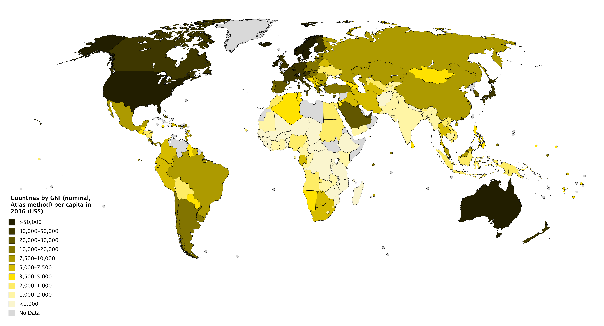

```{r setup, include=FALSE}
knitr::opts_chunk$set(echo = TRUE)

# Some useful libraries
library(leaps)
library(rvest)
library(car)
library(corrplot)
```

## Introduction




One of the great economists of the 20th century, Robert Lucas, once wrote:

> I do not see how one can look at [GDP] figures like these without seeing them as
representing possibilities ... The consequences for human welfare involved in questions like these are simply staggering: Once one starts to think about them, it is hard to think
about anything else.

In the spirit of this quote, we will explore what factors impact countries' GNI per capita, which roughgly translates to average income. Unlocking the patterns to economic growth could have staggering impacts on the development of nations. There are a countless number of potential factors: location, urbanization, openness to trade, etc. We will begin by analyzing the impacts of two individual factors and eventually create a general linear model that seeks to use a multitude of categorical and quantitative variables to predict GNI per capita. 

<P style="page-break-before: always">
## Data Gathering and Cleaning

First, let's get some relevant data from the World Bank (2016).
```{r}
wb <- read.csv("WB.2016.csv")
```

The World Bank 2016 dataset comes with 29 columns We will add two categorical variables, "Continent", which contains the Continent for each country, and "isRural", which indicates whether or not a nation is rural or urbanized.

To construct the "Continents" variable, we will scrape a list from a website that has the name of each continent and every country within it as a bullet list right below it. The first data cleaning task is to rename the countries in the scraped list with their name in the World Bank data. For example, "Cape Verde" is "Cabo Verde" in the World Bank data. We end up with an array of continent names followed by the countries within them.

```{r echo=FALSE}
# Url for site with continents and list of countries underneath
url <- "https://www.worldatlas.com/cntycont.htm"
webpage <- read_html(url)
countries <- html_text(html_nodes(webpage, 'ul+ h2 , p~ ul li , p+ h2'))
```
```{r}
# Clean some names to match with World Bank
wb$Country <- gsub("Korea, Dem.*", "Korea, Dem\\. People Rep\\.", wb$Country)
to_replace <- c("Bahamas", "Cape Verde", "Brunei", "Burkina", "Congo, Democratic Republic of", "^Congo$", "Ivory Coast", "Egypt", "Gambia", "Iran", "Korea, North", "Korea, South", "Kyrgyzstan", "Laos", "Macedonia", "Micronesia", "Burma \\(Myanmar\\)", "Syria", "East Timor", "Yemen", "Venezuela", "Saint", "Slovakia")
replace_with <- c("Bahamas, The", "Cabo Verde", "Brunei Darussalam", "Burkina Faso", "Congo, Dem. Rep.", "Congo, Rep.", "Cote d'Ivoire", "Egypt, Arab Rep.", "Gambia, The", "Iran, Islamic Rep.", "Korea, Dem. People Rep.", "Korea, Rep.", "Kyrgyz Republic", "Lao PDR", "Macedonia, FYR", "Micronesia, Fed. Sts.", "Myanmar", "Syrian Arab Republic", "Timor-Leste", "Yemen, Rep.", "Venezuela, RB", "St.", "Slovak Republic")

for (i in 1:length(to_replace)) {
  countries <- gsub(to_replace[i], replace_with[i], countries)
}
```

Next, to assign the correct continent to each country, we will loop through the countries in the World Bank data and find what index in the array each country is. Then we will go backwards through the array until we run into a continent name, and assign that continent to the country. 

The continents are either Africa, Asia, Europe, North America, Oceania, South America, or Other. The "Other" category was made when we ran into the issue of finding a nation in the World Bank data that wasn't in the scraped data. Those were all territories that are not fully independent, so we put them in another category instead of having them be in a specific continent. 

The following code contains the logic for determining the correct continent.
```{r}
continents <- rep(NA, length(wb$Country))
for (i in 1:nrow(wb)) {
  if (!wb$Country[i] %in% countries) {
    continents[i] <- "Other"
    next
  } else {
    index <- which(countries == wb$Country[i])[[1]]
    while (TRUE) {
      index <- index - 1
      if (grepl("AFRICA", countries[index])) {
        continents[i] <- "Africa"
        break
      } else if (grepl("ASIA", countries[index])) {
        continents[i] <- "Asia"
        break
      } else if (grepl("EUROPE", countries[index])) {
        continents[i] <- "Europe"
        break
      } else if (grepl("N\\. AMERICA", countries[index])) {
        continents[i] <- "North America"
        break
      } else if (grepl("OCEANIA", countries[index])) {
        continents[i] <- "Oceania" 
        break
      } else if (grepl("S\\. AMERICA", countries[index])) {
        continents[i] <- "South America"
        break
      }
    }
  }
}
wb$Continent <- continents
```

Next, we will create the "isRural" categorical variable that will denote whether or not a country is rural or urbanized. isRural will be true for a country with more than 50% of its population living in rural areas. We calculate it based on the "Rural" column in the original World Bank data, which gives the percentage of the population in each country living in rural areas.
```{r}
wb$isRural <- ifelse(wb$Rural > 50, TRUE, FALSE)
```
We now have our complete dataset.

<P style="page-break-before: always">
## Selected Variables

Now, we select the variables that wish to use in our analysis and clean the dataframe by removing all of the rows with NAs in any of those selected columns.
```{r}
wb <- wb[, c("Country", "GNI", "Imports", "Exports", "Fertility66", "Fertility16", "InfMort", "Continent", "isRural")]
wb <- na.omit(wb)
```

We also don't want any of the territories in our data as many of them are uncharacteristically small and dependent on another nation, which could create issues when we assume that all of our data is independent.
```{r}
wb <- wb[!(wb$Continent == "Other"), ]
```

To get a preliminary glance at the data we will use, we construct a matrix scatterplot to check for non-linearity in the data (temporarily removing the categorical variables). Since we've seen many times that anything related to income will be close to an exponential distribution, we will predict log(GNI per capita) instead of GNI per capita. 
```{r echo=FALSE}
wbtemp <- wb[, !(colnames(wb) %in% c("Country", "Continent", "Surplus"))]
wbtemp$GNI <- log(wb$GNI)

# Get pairsJDRS function
source("http://www.reuningscherer.net/s&ds230/Rfuncs/regJDRS.txt")
pairsJDRS(wbtemp)
```

Based on this matrix of scatterplots and histograms, we will make transformations to normalize the data and linearlize the relationships. Most of the variables that have a nonlinear relationship with log(GNI per capita) seem to be exponentially distributed with a long right tail, so we make the following transformations:

*  log(GNI per capita)
*  log(Imports)
*  log(Exports)
*  log(InfMort)

Now, we construct the final dataset with the transformed variables we will use.
```{r}
# Make the transformed variables
wb$logGNI <- log(wb$GNI)
wb$logImports <- log(wb$Imports)
wb$logExports <- log(wb$Exports)
wb$logInfMort <- log(wb$InfMort)

wb2 <- wb[, c("Country", "logGNI", "logImports", "logExports", "Fertility66", "Fertility16", "logInfMort", "Continent", "isRural")]
```
Here is the list of the final variables:

*  Country - Name of the Country
*  logGNI - Log of GDP per capita, measured in log(dollars per person)
*  logImports - Log of imports as a percentage of GDP
*  logExports - Log of exports as a percentage of GDP
*  Fertility66 - Fertility rate (births per woman), 1966
*  Fertility16 - Fertility rate (births per woman), 2016
*  logInfMort - Log of infant mortaility rate per 1,000 pepole
*  Continent - Continent of the country, "Other" if it's a territory
*  isRural - TRUE if >50% of the population is in rural areas, FALSE otherwise

Imports and exports were chosen since in a globalized economy, more exposure to trade would allow more countries to exploit their comparative advantage, yielding dramatic welfare gains. Fertility rates in both 1966 and 2016 were chosen since both variables have large impacts on a country's population pyramid. A country with more people in the 25-40 range instead of 10-20 range would seem to have a higher potential for growth. Infant mortality was chosen as a proxy for health services. The last two categorical variables detect differences in geography and urbanization.

<P style="page-break-before: always">
## Urbanization and Growth

In this section, we use a t-test to determine whether or not there exists a difference in logGNI between countries that count as rural (as determind earlier) and those count as urbanized. From a developmental standpoint, it seems like throughout history, urban centers are places where innovation occurs the most. Thus, we would expect that more urbanization would drive more growth as people move towards more productive jobs that are only available when many people are working in the same area. 

We first make a box-plot of logGNI vs isRural.
```{r echo=FALSE}
boxplot(wb2$logGNI ~ wb2$isRural, main="Log GNI by Rural and Urban Countries", names=c("Urban", "Rural"), ylab="Log GNI", col="yellow")
```

It seems like our prediction holds true. The urban countries have a larger spread of log GNI per capita than the rural countries, but the median seems significantly higher. Before we run the t-test, we check for normality by using a normal quantile plot.
```{r echo=FALSE, results=FALSE}
gnir <- wb2[wb2$isRural, "logGNI"]
gniu <- wb2[!wb2$isRural, "logGNI"]
qqPlot(gnir, main="Normal Quantile Plot for logGNI of Rural Nations", ylab="logGNI, Rural")
qqPlot(gniu, main="Normal Quantile Plot for logGNI of Urbanized Nations", ylab="logGNI, Urbanized")
```

Although the distribtion of GNI per capita for urbanized countries might be a little left skewed, both quantile plots show that the data is sufficiently normal. We will also make the simplifying assumption that nations are free to pick and choose their own policies since there is no world government that can compel nations to do anything. Thus, we can assume that all of our observations are independent. Since we meet all of the necessary assumptions, we can conduct a one-sided t-test to see if urban log(GNI per capita) is greater than rural log(GNI per capita).

```{r echo=FALSE}
t.test(gniu, gnir, "greater")
```
We end up with a p-value of almost zero, which means that there is evidence that nations that are urbanized have higher log(GNI per capita) than countries that are not urbanized. We are also 95% confident that the true impact of urbanization on log(GNI per capita) is greater than 1.77 (the difference of the means). Instead of the t-test, we could also perform a bootstrap with 10000 resamples, which should yield similar results.

```{r echo=FALSE}
N <- 10000
diff <- rep(NA, N)
for (i in 1:N) {
  data_1 <- sample(gniu, length(gniu), replace = TRUE)
  data_2 <- sample(gnir, length(gnir), replace = TRUE)
  diff[i] <- mean(data_1) - mean(data_2)
}
ci <- quantile(diff, c(0.05, 1)) # bootstrapped t-test

t_tested <- t.test(gniu, gnir, "greater")$conf.int # original t-test

hist(diff,col="blue",main="Bootstrapped and Theoretical Confidence Interval for Difference\nin Mean Log GNI for Urban vs. Rural Nations",xlab="Differnce in Means Between Urban Log GNI and Rural Log GNI ",breaks=50, xlim=range(1,2.5))
abline(v=ci[1],lwd=3,col="red")
abline(v=t_tested,lwd=3,col="green",lty=2)
legend(2.1,450,c("Original CI","Boot CI"),lwd=3,col=c("green","red"),lty=c(2,1))
```

The 95% confidence interval predicted by the bootstrap is almost exactly the same as that of the t-test. There is no vertical line for the upper bound of the confidence interval since that line exists at positive infinity. Overall, these results support the fact that having a larger urban population is associated with higher incomes. 

<P style="page-break-before: always">
## Export-Oriented Industrialization

The miraculous growth of Japan and the "Asian Tigers" (Hong Kong, Taiwan, South Korea, Singapore) in the late 20th century have been critical to the understanding of economic development. All of these nations followed a pattern of export-oriented industrialization, where a large share of their economies were built around satisfying international demand. Furthermore, with more trade with the rest of the world, these nations naturally benfitted from the law of comparative advantage. Thus, some economists have argued that having more exports should be associated with higher living standards. In our case, to see how a more export-based economy could affect GNI, we do a correlation between logExports and logGNI. 
```{r}
plot(wb2$logExports, wb2$logGNI, main="Log GNI vs. Log Exports by Country", xlab="Log Exports", ylab="Log GNI", pch=19, col="blue")
```

From the scatterplot, we can see a lienar trend between the log(Exports) and log(GNI per capita) that seems homoskedastic. There are at most two points that can be classified as having higher leverage, but they are not so far removed from the data to have that much of an impact. All in all, we have reasonably met the assumptions to run a correlation test, which we will do now.

```{r}
cor.test(wb2$logExports, wb2$logGNI)
```

The t-test on Pearson's correlation gave a highly significant p-value of almost 0, and we are are 95% confident that the true Pearons's correlation coefficient lies beteween .29 and .55. 

<P style="page-break-before: always">
We can also verify our results with a nonparametric permutation test with 10000 samples on correlation.
```{r}
n_samp <- 10000
corResults <- rep(NA, n_samp)
for(i in 1:n_samp){
  #get vector of rows in our fake sample
  corResults[i] <- cor(sample(wb2$logExports), wb2$logGNI)
}
#Two-sided p-value for correlation
truecor <- mean(abs(corResults) >= abs(cor(wb2$logExports, wb2$logGNI)))

#Make histogram of permuted correlations
hist(corResults, col = "yellow", main = "", xlab = "Correlations", breaks = 50, xlim=range(-.47, .47))
mtext("Permuted Sample Correlations for Log GNI vs. Log Exports", cex = 1.2, line = 1)
mtext(paste("Permuted P-value =",round(truecor,4)), cex = 1, line = 0)
abline(v = cor(wb2$logExports,wb2$logGNI), col="blue", lwd=3)
text(cor(wb2$logExports,wb2$logGNI)-.02, 200 ,paste("Actual Correlation =", round(cor(wb2$logExports,wb2$logGNI),2)),srt = 90)
```

The permutation test yielded 0 permutations that were as extreme as the actual correlation (p-value of 0), so we reject the null hypothesis and conclude that we have evidence of a non-zero correlation between log(Exports) and log(GNI per capita). Specifically, a positive correlation indicates that countries that have a higher log(share of GDP as exports) tend to have higher log(GNI per capita), providing evidence for our prior beliefs of the importance of exports and trade for a nation wealth.

<P style="page-break-before: always">
## A General Linear Model for Predicting logGNI

In this section we will fit a general linear model to predict logGNI using the variables that we identified at the beginning of this document. We will then perform a backwards stepwise reggression to elimiate factors until all are significant. Lastly, we will analyze the residual plots and conclude. First, we will create a correlation plot to check identify any particular cases of multicollinearity. 
```{r echo=FALSE, message=FALSE}
#Make correlation plot for retained variables
wbtemp <- wb2[, !(colnames(wb2) %in% c("Country", "Continent", "isRural"))]

sigcorr <- cor.mtest(wbtemp, conf.level = .95)
corrplot.mixed(cor(wbtemp), lower.col="black", upper = "ellipse", tl.col = "black", number.cex=.7, tl.pos = "d", tl.cex=.7, p.mat = sigcorr$p, sig.level = .05)
```

Since we've already made our transformations earlier, we won't need to again. The correlation plot above shows that there might be some multicollinearity among Fertility66, Fertility 16, and logInfMort, as well as between logImports and logExports. However, there is nothing uncommonly strong and we should be able to continue with fitting a model. We will first fit the model with all of the predictors that we mentioned earlier.
```{r echo=FALSE}
lm1 <- lm(wb2$logGNI ~ wb2$logImports + wb2$logExports + wb2$Fertility66 + wb2$Fertility16 + wb2$logInfMort + wb2$Continent + wb2$isRural)
summary(lm1)
```
The F-statistic is clearly significant, meaning that there is evidence for a relationship between our predictors and log(GNI per capita). The model accounts for approximately 82% of the variance in log(GNI per capita). However, some of the predictors are nonsignificant, so we will perform backwards stepwise regression and remove them, starting with the least significant predictor, Fertility66. 

```{r}
fin <- lm(wb2$logGNI ~ wb2$logImports + wb2$logExports + wb2$logInfMort + wb2$Continent + wb2$isRural)
summary(fin)
```
We ended up only removing Fertility66 and Fertility16, which was a little surprising given the fact that most nations with higher GDP per capita tend to have low fertility rates while countries with lower GDP per capita tend to high fertility rates. It seems possible that infant mortality may have taken away the effect of fertility rates (saw some multicollinearity earlier), as the a major reason why nations have higher fertility rates is because of high infant mortality rates. 

At this point, all predictors are significant at the alpha = 0.05 level (one level of Continent is, so we keep that in). Our final model still has an R-squared of about 82%, so we didn't lose much prediction power. We end up with the following predictors being significantly associated with higher log(GNI per capita):

*  Lower share of imports in GDP
*  Higher share of exports in GDP
*  Lower infant mortaility rates
*  Being a country from Oceania (size matters?)
*  Being an urbanized country

Finally, to check our model assumptions, we will look at residual plots.

```{r echo=FALSE}
myResPlots2(fin, label="Log GNI")
```

Overall, the model assumptions seem satisfied:

*  Normally distributed residuals (or very close to it)
*  No evidence of heteroskedasticity
*  Two possible outliers
*  No extremely influential points
*  No discernable pattern in the residual plot

<P style="page-break-before: always">
## Conclusion

Determining the factors for economic growth has always been an important yet complicated question for both historians and economists. We first found that countries that were urbanized had a higher GNI per capita than those that were not. Next, we discovered a significant, positive correlation between the percentage of GDP spent on exports and GNI per capita, providing evidence that there are gains from trade. In our final model, we find that higher GNI per capita is driven by lower imports, higher exports, lower infant mortality, and urbanization. This suggests that nations that want to develop should incentivize export-oriented business, invest in health care, and attempt to urbanize. Of course, there could be many more factors such as whether or not citizens have political rights or civil liberties, but what we have right now is a strong start.
